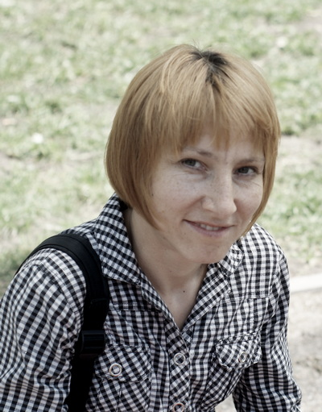

## _rsschool-cv_

# Nadya Molotova

---

### Junior Frontend Developer

---

> **Contact information:**

> Phone: +38 068 811-61-22,\
> E-mail: nadya.molotova@gmail.com,\
> Telegram: Molotova Nadya

---

**Briefly About Myself**

I’m working in the field of intellectual property. I've always been interested in something new, technical. And I’m interested in Web Development because this occupation provides endless possibilities for professional growth.
I believe, that my ability to learn and to gain new skills will lead me through this path of becoming a proficient Frontend Developer.

---

**Skills and Proficiency:**

- HTML5, CSS3,
- JavaScript Basics,
- Git, GitHub,
- VS Code,
- Adobe Photoshop, Illustrator

---

**Code example:**

    Задание:\
    Запросите у пользователя число. Выведите все числа в обратном порядке от введенного пользователем значения до 1. Используйте для решения рекурсию.

    ''

---

**Courses:**

- HTML and CSS Started on the ITVDN (completed),
- RS Schools Course «JavaScript/Front-end. Stage 0» (in progress)

---

**Languages:**

- English - Intermediate,
- Russian - Native,
- Ukrainian - Native
